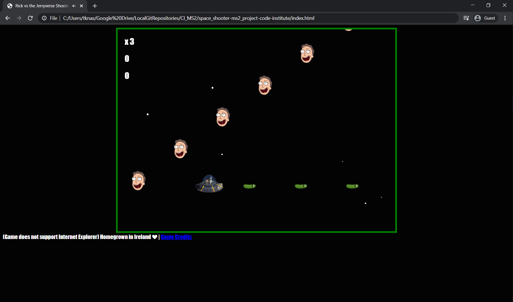
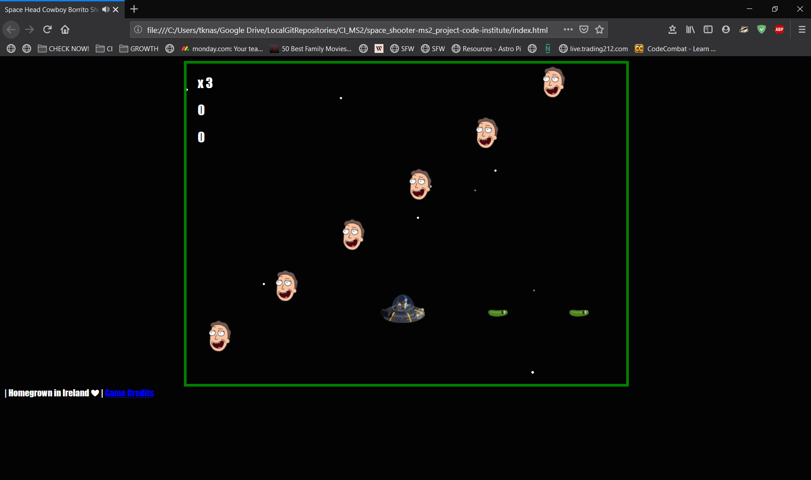
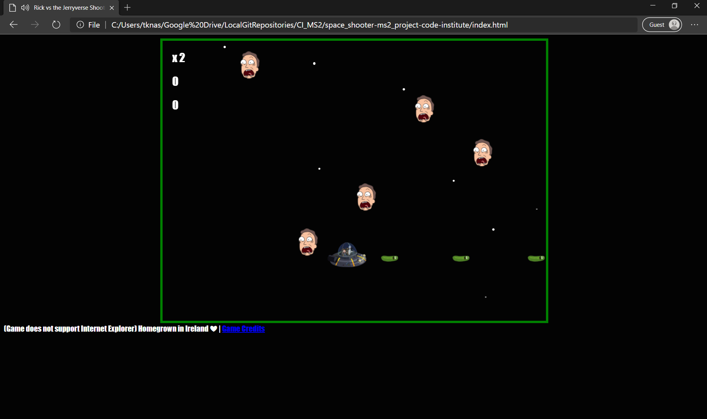
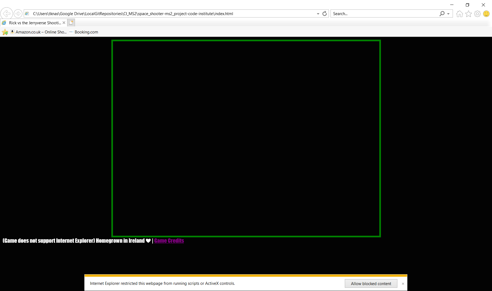
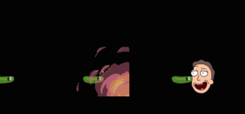
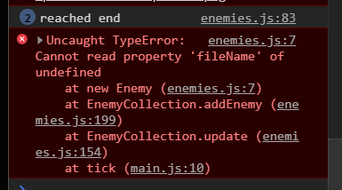

<h1 align="center">
Interactive Frontend Milestone Project 2 - Rick's Space Shooter Game
</h1>

<h1 align="center">

</h1>
<br>

<div align="center">

_Dark and cold, Rick & Morty wake up in their spacecraft without any knowledge of where they are. It took Rick a few seconds though to realise they just transported to Rick's most hated universe, which he calls.._ **THE JERRY VERSE!!!**

_They have to navigate their way to find Rick's Portal gun that seems to be on a distant planet called, FCK3CPO._

_And the adventure begins!_

[**CLICK HERE TO PLAY THE GAME!**](https://zionx42.github.io/space_shooter-ms2_project-code-institute/)

</div>

<div align= "center">

(This game was made possible thanks to video tutorial by [Bluefever Software](https://www.youtube.com/playlist?list=PLZ1QII7yudbdBS1ymLLrVYNR_v9cCnCYi))

</div>

---

<h2> Table of Content:</h2>

1. [**UX Development**](#ux-development)

   - [**Project Purpose**](#project-purpose)
   - [**Game purpose**](#game-purpose)
   - [**Target Audience**](#target-audience)
   - [**Player Experience**](#player-experience)
   - [**Wireframe**](#wireframe)

2. [**Game Features**](#game-features)
3. [**Future Updates**](#future-updates)
4. [**Technologies Used**](#technologies-used)
5. [**Testing**](#testing)

    - [**Automated Testing**](#automated-testing)
    - [**Browser Testing**](#browser-testing)
    - [**Game Modal**](#game-modal)
    - [**Game Start**](#game-start)
    - [**Sound Effects**](#sound-effects)
    - [**Javascript Validation**](#javascript-validation)
    - [**Bugs Found**](#bugs-found)

6. [**Credits**](#credits)
   - [**Images**](#images)
   - [**Sounds**](#sounds)
   - [**Game Development**](#game-development)
7. [**Acknowledgement**](#acknowledgement)
8. [**Disclaimer**](#Disclaimer)

<br>

---

## UX Development

### Project Purpose

A desktop Space Shooter game that brings back the nostalgic 80s era with a modern Rick & Morty themed twist.

<br><br>

<br><br>

### Target Audience

Rick vs The Jerryverse is defined as a watercooler game. The purpose of the game is to entertain the player while they are on a quick coffee or lunch break.

### Game Purpose

It offers them a time to escape the environment they are in and gets to enjoy a themed shooter game for characters they are familiar with from the TV show [Rick & Morty](https://en.wikipedia.org/wiki/Rick_and_Morty).

### Player Experience

The player user experience is designed to easily allow the player to jump right into the game with very little knowledge on how to play it.

The music starts when the game starts and it allows for a more entertaining atmosphere and longer gameplay.

There is a countdown indicator that helps the player get ready.

Minimal keypresses. Only 5 keys are needed to play the game.

Spacebar to start the game and the directional keys to move the spacecraft left, up, down and right:

<br><br>

<br><br>

### Wireframe

The "User Journey" gameplay wireframing was designed with [Balsamiq](https://balsamiq.com/).

- The user journey starts with the player arriving at starting dashboard of the game:

<br><br>

<br><br>

- The game starts the countdown after clicking on the keyboard Spacebar:

<br>
    
<br><br>

- If the player loses their lives it's game over. They can press spacebar to restart the game:

<br><br>

<br><br>

## Game Features

The game has one level with multiple enemy facial expressions of Jerry's heads. You get 100 points every time you shoot a Head with a bullet.

<br><br>

<br><br>

The bullets are designed to look like Pickled Rick as a tribute to one of the best episodes of the series.

<br><br>

<br><br>

One of my other more watched episodes is where Destroy heads were introduced to the series. It also gave me the idea of Jerry's heads. So I added Destroy heads as one of the bigger enemies:
<br><br>

<br><br>

## Future Updates

- More background music choices.
- Add Rick & Morty reaction voices
- split music between gameplay and game prestart
- add levels to the game
- Add life boosters to the game
- More enemy types like Slug Jerry

## Technologies Used

The technology platforms that I used to develop this game:

**JQuery:** JQuery has been used to simplify DOM manipulation.

**VS Code:** One of the best IDE code editors I ever used, and one that I had to learn from the ground up for this project.

**Github:** Where all the repositories that were pushed from VSC.

**Bootstrap:** It was used for the "Go to Game" buttons.

## Testing

### Automated Testing

Code validation was tested using these websites:

- [W3C Markup Validation Service](https://validator.w3.org/) Used to test HTML
- [W3C CSS Validation Service](https://jigsaw.w3.org/css-validator/) Used to test CSS

### Browser Testing

Since this is a desktop game it was regularly tested in all the main browsers that are currently used globally. The browsers tested included:

Chrome:
<br><br>

<br><br>

Firefox:
<br><br>

<br><br>

The new Microsoft Edge 10:
<br><br>

<br><br>

The game is not compatible with Internet Explorer due to Active X controls regularly being blocked.

<br><br>

<br><br>

### Game Modal

The game interaction was checked for first impressions. They included:

- The game area is centered correctly in the browser.
- The background music doesn't start until the game starts
- The colour theme is consistent with the game. 
- Dark mode was chosen since the game is based in space and it is also easier on the eyes.
- The instructions were easy to read and understand.

### Game Start

When the game starts the player position starts in a safe place. This is to help the player to familiarise themselves with the movement speed and directions.

### Sound Effects

The sound effects (SFX) are selected after researching most universal sounds for certain effects.

For example, the sounds of the explosions are very familiar and relevant to the other explosion sounds. 

**Sound Duration**

The time length of the sound was essential for a more synced and realistic feel.

Testing was done on the SFX duration, whether explosion or game over, correspond correctly. 

Key sound adjustment elements I took into account were:

- Animation duration of the explosion
- Reaction time to being hit
- Sound quality
- Sound matching with the scenario


### Javascript Validation

When it came to Javascript most of the support and code validation came from posting questions like this on [StackOverflow](https://gamedev.stackexchange.com/questions/182839/how-do-i-set-bullets-to-shoot-from-the-correct-position-on-the-sprite).

The Code Institute Tutors were also key in validating the JS & jquery code.

Tools also used to validate JS:

- [JShint](https://jshint.com/)
- [Code Beautify JavaScript Validator](https://codebeautify.org/jsvalidate)

### Bugs Found

There were three major bugs found:

1. Error with Explosion animation not appearing on the screen.

Every time the enemy was hit with the bullet an explosion animation was supposed to appear for 0.8 seconds. There was nothing appearing

**Solution**

There were incorrect source url referencing in the `explosion`  class in the `styles.css`. What needed was to add "`../`" before the url.

```
@keyframes explosion {
    0%   {background-image: url("../assets/explosion/smallexplode1.png");}
``` 

2. Explosion animation visual offset 

The explosion animation was not centered correctly as indicated in the image below. There were no errors either to trace.

<br>

<br>

**Solution**

Consulted with the Code Institute tutors and ask questions in [StackOverflow](https://gamedev.stackexchange.com/questions/183298/enemy-explosion-offset-is-displaced-away-from-desired-point-of-origin). 

I realised after a while that the images were larger the designated width and hight. Larger by 100px.
```
.explosion {
  width: 100px;
  height: 100px;
  ```

The problem was fixed with I resized the ecplosion images to match 100px in width and hgith using Microsoft Photos.

3. Error with game freezing few minutes into playing the game.

The game kept freezing while playing the same position. 

<br>

<br>

Even with the support of the CI tutor and few internal programmers slack channels we couldn't find the cause of the error. 

**Solution**

Simply a typo in one of the `enemies.js` files. It was a letter case-sensitivity issue. It was supposed to be a lower case 'e' in `enemies/` instead of uppercase 'E':

```
createSequence(
    600,
    "enemies/jerryHead2",
    1,
```


## Credits

### Content

All the content was written by Rick Nassar.

### Images

Spacecraft by <a href="https://wall.alphacoders.com/big.php?i=625914">Wallpaper Abyss</a>. It was cropped and background removed with PowerPoint 2016.</li>

Enemies & Bullet by <a href="https://www.pinclipart.com/pindetail/iTxbTom_download-pickle-rick-from-rick-and-morty-clipart/">Pin Clipart</a>.

Background stars scrolling by [ohan JKarlsson](https://codepen.io/DonKarlssonSan/pen/qEQVaK).

Explosions by [Gifer](https://gifer.com/en/VRwF).

Splitting GIF into static png images: [Ezgif](https://ezgif.com/split).

### Sounds

Sound Effects <a href="https://github.com/bluefeversoft/html_invaders">bluefeversoft</a> and <a href="https://freesound.org/people/HenryRichard/sounds/448266/">HenryRichard</a>.

Shooting sounds and other play sounds by <a href="http://www.kenney.nl">Kenney</a>.
  
Background music from <a href="http://www.nosoapradio.us/">nosoapradio</a>.

### Game Development

Space Shooter styles & Libraries:

- [rinovethamoses97](https://github.com/rinovethamoses97/Space-Invaders-Game)
- [Jafnee](https://github.com/Jafnee/Generic-Space-Shooter)

README referenced from [CharlieJT](https://github.com/CharlieJT/Simon-Memory-Game)

## Acknowledgement

JS file libraries used in the game were pulled from [bluefeversoft](https://github.com/bluefeversoft/html_invaders) and edited to match this game's mechanics.

The tutorial for the game dynamics and how-to code is based on Bluefever Sofware's youtube playlist [HTML Invaders](https://www.youtube.com/playlist?list=PLZ1QII7yudbdBS1ymLLrVYNR_v9cCnCYi).

Special thanks to some of the tutors at Code Institute who were essential in completing this project, especially to Scott Kipp and Tim Nelson who went above and beyond to support me to the very end!

## Disclaimer

All content on the website, including images, are used for educational purposes only.

All the code is open-sourced under GNU General Public License v3.0 and permission was granted to use any code libraries for the development of this game.
