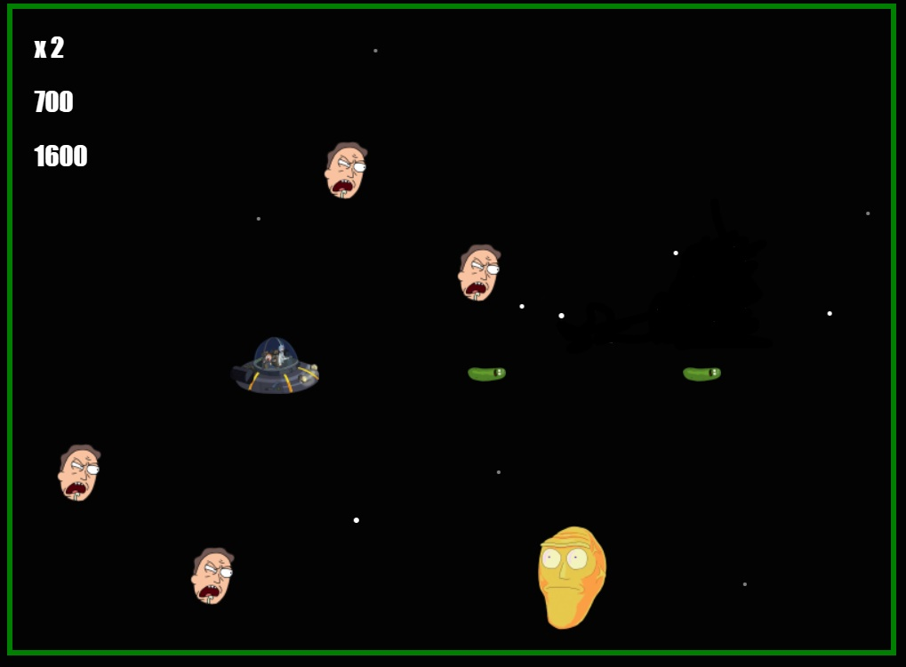
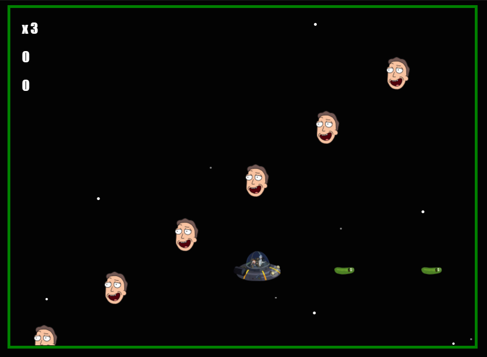
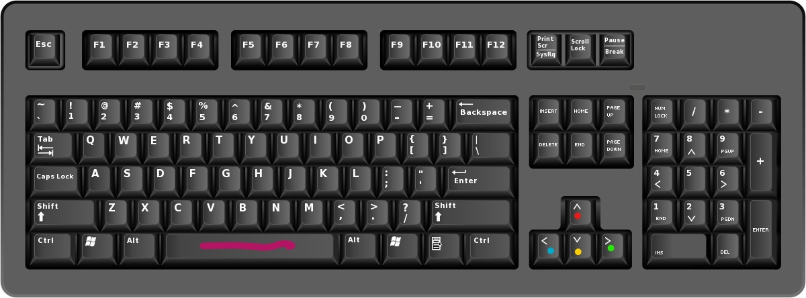
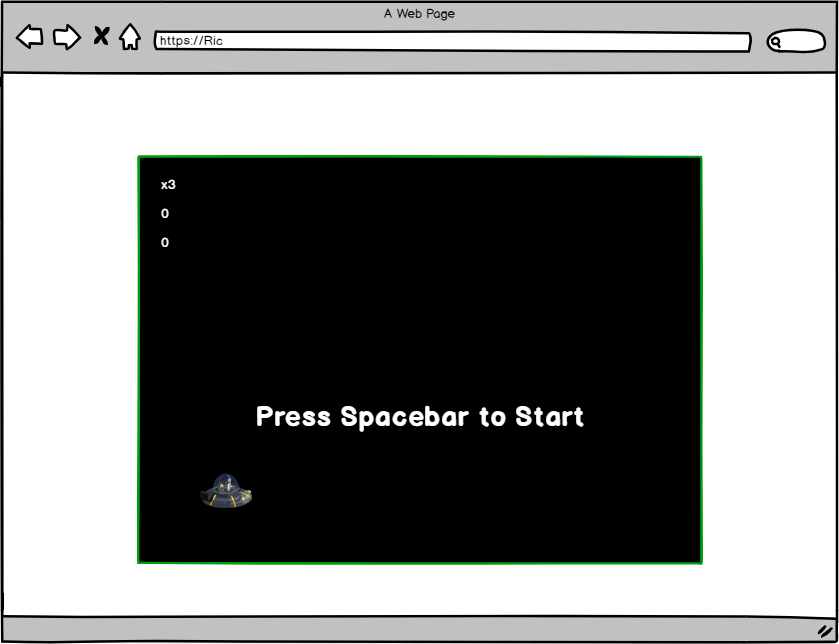
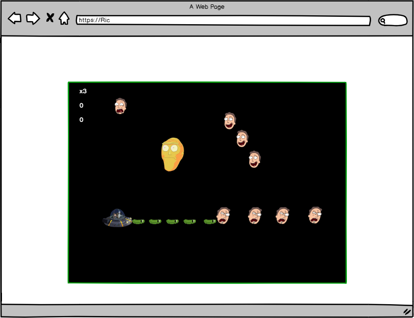
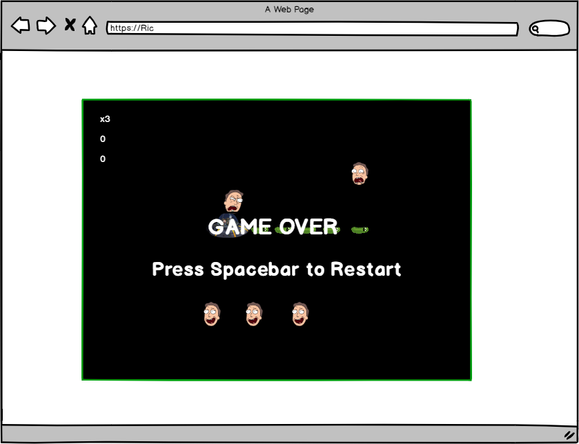
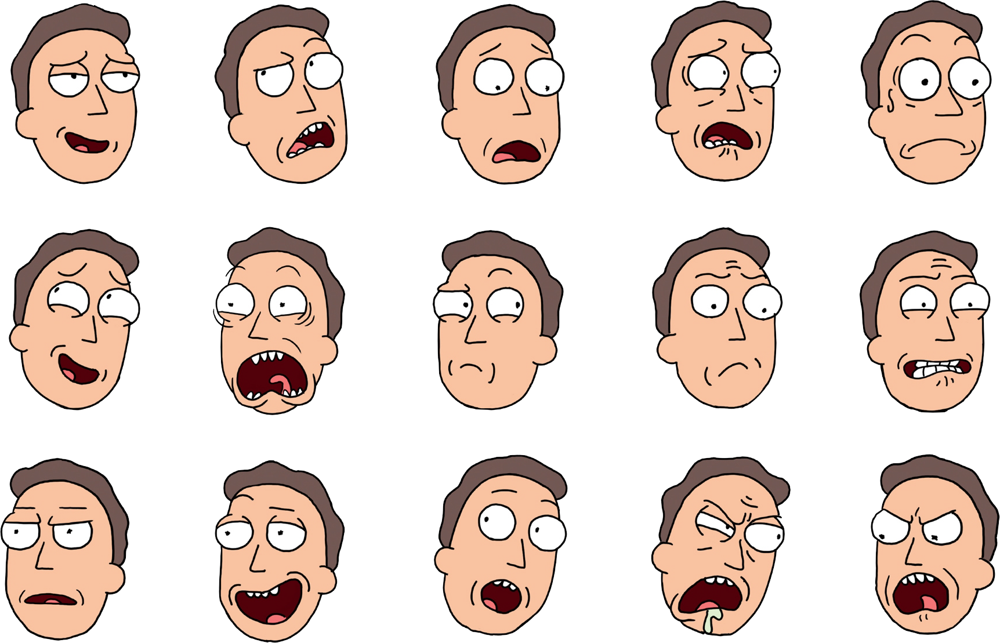
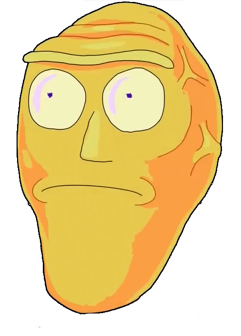

<h1 align="center">
Interactive Frontend Milestone Project 2 - Rick's Space Shooter Game
</h1>

<h1 align="center">

</h1>
     

 

*Dark and cold, Rick & Morty wake up in their spacecraft without any knowledge of where they are. It took Rick a few seconds though to realise they just transported to Rick's most hated universe, which he calls..* **THE JERRY VERSE!!!**

*They have to navigate their way to find Rick's Portal gun that seems to be on a distant planet called, FCK3CPO.*

*And the adventure begins!*

[**CLICK HERE TO PLAY THE GAME!**](https://zionx42.github.io/space_shooter-ms2_project-code-institute/)

 

---

<h2> Table of Content:</h2>

1. [**Development**](#Development)
    
    - [**Project Purpose**](#project-purpose)
    - [**Player Experience**](#player-experience)
    - [**Wireframe**](#wireframe)
2. [**Game Features**](#game-features)  
3. [**Future Updates**](#future-updates)
4. [**Technologies Used**](#technologies-used)
5. [**Testing**](#testing)
6. [**Credits**](#credits)
    - [**Images**](#images)
    - [**Sounds**](#sounds)
    - [**Game Development**](#game-development)
7. [**Acknowledgement**](#acknowledgement)
8. [**Disclaimer**](#Disclaimer)

---
## Development

### Project Purpose

A desktop Space Shooter game that brings back the nostalgic 80s era with a modern Rick & Morty themed twist.

  
    
  
### Player Experience

The player will directly find an ease jumping right into the game with very little knowledge on how to play it. 

The music starts when the game starts and it allows for a more entertaining atmosphere and longer game play

There is a countdown indicator that helps the player get ready.

Minimal keypresses. Only 5 keys are needed to play the game. 

Spacebar to start the game and the directional keys to move the spacecraft left, up, down and right:

  
    
  

### Wireframe

The "User Journey" gameplay wireframing was designed with [Balsamiq](https://balsamiq.com/).

- The user journey starts with the player arriving at starting dashboard of the game: 

  
    
  

- The game starts the countdown after clicking on the keyboard Spacebar: 

 
    
  

- If the player loses their lives it's game over. They can press spacebar to restart the game: 

  
    
  

## Game Features

The game has one level with multiple enemy facial expressions of Jerry's heads. You get 100 points every time you shoot a head with a bullet.

  
    
  

The bullets are actually designed to look like Pickled Rick as tribute to one of the best episodes of the series.  

  
    
  

One of my other more watched episodes is where Destroy heads were introduced to the series. It also gave me the idea of Jerry's heads. So I added Destroy heads as one of the bigger enemies:
  
    
  

## Future Updates

- More background music choices. 
- Add Rick & Morty reaction voices 
- split music between gameplay and game prestart
- add levels to the game
- Add life boosters to the game
- More bigger enemies

## Technologies Used

The technology platforms that I used to develop this game:

**JQuery:** JQuery has been used to simplify DOM manipulation.

**VS Code:** One of the best IDE code editors I ever used, and one that I had to learn from the ground up for this project.

**Github:** Where all the repositories that were pushed from VSC.

## Testing

The game was regularly tested in multiple browsers, which were Chrome, MS Edge and Firefox.

Code validation was tested using these websites:

- [W3C Markup Validation Service](https://validator.w3.org/) Used to test HTML
- [W3C CSS Validation Service](https://jigsaw.w3.org/css-validator/) Used to test CSS

### Javascript Validation

When it came to Javascript most of the support and code validation came from posting questions on [StackOverflow](https://gamedev.stackexchange.com/questions/182839/how-do-i-set-bullets-to-shoot-from-the-correct-position-on-the-sprite). 

The Code Institute Tutors were also key in validating the JS & jquery code.

<!-- Tools also used to validate JS:

- [JShint](https://jshint.com/)
-  -->

## Credits

### Content

All the content was written by me.

### Images

Spacecraft by <a href="https://wall.alphacoders.com/big.php?i=625914">Wallpaper Abyss</a>. It was cropped and background removed with PowerPoint 2016.</li>

 Enemies & Bullet by <a href="https://www.pinclipart.com/pindetail/iTxbTom_download-pickle-rick-from-rick-and-morty-clipart/">Pin Clipart</a>.

Background stars scrolling by Johan Karlsson: https://codepen.io/DonKarlssonSan/pen/qEQVaK

Explosions: [Gifer](https://gifer.com/en/VRwF)

Splitting GIF into static png images: [Ezgif](https://ezgif.com/split)

### Sounds

 Sound Effects <a href="https://github.com/bluefeversoft/html_invaders">bluefeversoft</a> and <a href="https://freesound.org/people/HenryRichard/sounds/448266/">HenryRichard</a>

 Shooting sounds and other play sounds by <a href="http://www.kenney.nl">Kenney</a>.
              
Background music from <a href="http://www.nosoapradio.us/">nosoapradio</a>.

### Game Development

Space Shooter styles & Libraries: 
- [rinovethamoses97](https://github.com/rinovethamoses97/Space-Invaders-Game)
- [Jafnee](https://github.com/Jafnee/Generic-Space-Shooter)
- [bluefeversoft](https://github.com/bluefeversoft/html_invaders)

README referenced from [CharlieJT](https://github.com/CharlieJT/Simon-Memory-Game) 

## Acknowledgement

Special thanks to some of the tutors that were essential in completing this project, especially to Tim Nelson who went above and beyond to support me to the very end!

## Disclaimer
All content on the website, including images, are used for educational purposes only.